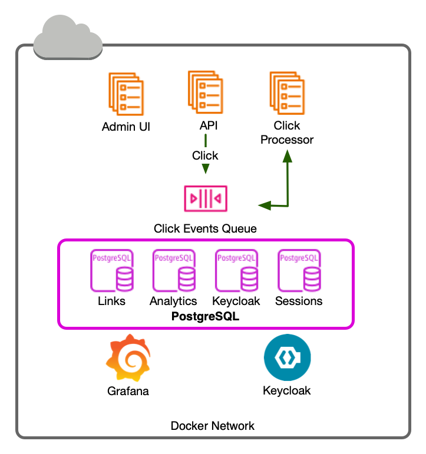
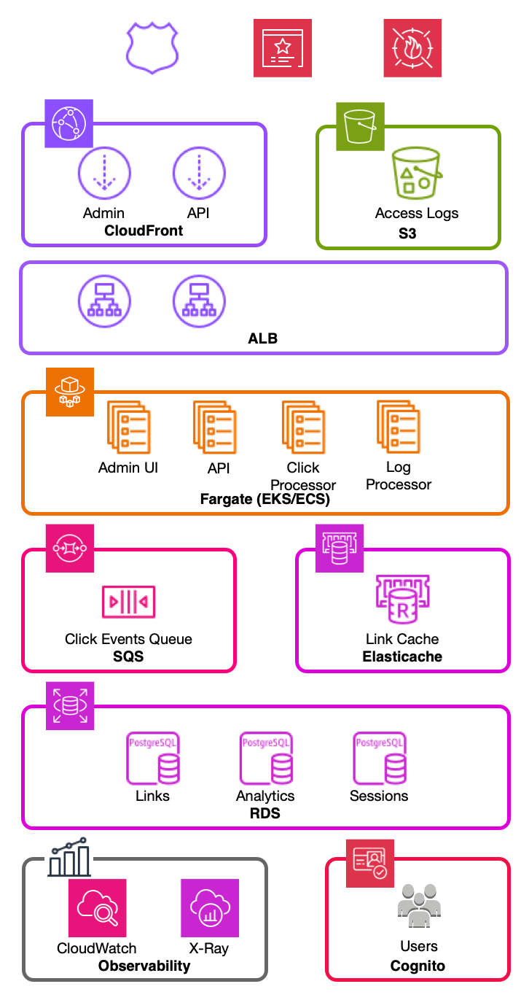

# URL Shortener Platform

A URL shortener built around one support workflow: someone reports a short link as phishing, and a
support engineer finds it, looks at its traffic, blocks it, and the block is recorded with who and
why. The API enforces who can do what; an HTMX admin UI sits on top. Clicks flow through an
event-driven pipeline (SQS), auth is Keycloak locally and Cognito on AWS, and everything reports to
OpenTelemetry. It all runs locally in Docker and is designed to map onto AWS.

To see the workflow: run the [Quickstart](#quickstart) (including `make demo-data`), then sign in
to the admin UI (http://localhost:8001) as `sam` / `password`.

- Design spec: [docs/superpowers/specs/2026-10-01-url-shortener-design.md](docs/superpowers/specs/2026-10-01-url-shortener-design.md)
- Implementation plans: [docs/superpowers/plans/](docs/superpowers/plans/)
- Deployment & operations (diagram, state, monitoring): [docs/operations.md](docs/operations.md)
- Terraform for AWS (designed, not built): [terraform/](terraform/)

# Running it

## Prerequisites (macOS)

<details>
<summary>Installing uv, jq and Docker via Homebrew</summary>

### Homebrew

[Homebrew](https://brew.sh) is the package manager used to install the core toolchain.

**Install Homebrew** (if not already installed):

    ❯ /bin/bash -c "$(curl -fsSL https://raw.githubusercontent.com/Homebrew/install/HEAD/install.sh)"

### One shot

    ❯ brew install docker-desktop jq uv

### Python tooling

**Install uv:**

    ❯ brew install uv

> [uv](https://docs.astral.sh/uv/) is the fast Python package manager used for all project dependencies and script execution.

### Command-line tools

**Install jq:**

    ❯ brew install jq

> [jq](https://jqlang.org) formats JSON responses for [`scripts/api.sh`](scripts/api.sh) and the [API walkthrough](#try-it-calling-the-api-as-each-role).

### Virtualization

- Docker with Compose v2 (`brew install docker-desktop`) - easier
- OR [colima](https://colima.run) ([`./scripts/install-colima.sh`](scripts/install-colima.sh)) - more fragile but free: `colima start --vm-type vz --cpu 4 --memory 8`

</details>

## Quickstart

```bash
make sync               # install the workspace
make up                 # start the whole stack: services, migrations, seeded Keycloak users
make e2e                # verify the running stack
```

### Add data and enter the UI

```bash
make demo-data          # demo links, clicks and moderation history to explore as sam
make ui                 # open a launchpad with links + status for every local UI
                        # (ARGS=--all: to open them all in a browser)
```

### Seeded users

Local development only. Every user's password is `password`.

| User | Role |
|---|---|
| alice | admin |
| eddie, erin | editor |
| victor | viewer |
| sam | support (block/unblock any link; no create, edit or delete) |
| nora | (none) |

Edit [`infra/keycloak/users.yaml`](infra/keycloak/users.yaml) and run `make seed-users` (inside compose) or [`scripts/seed-users`](scripts/seed-users)
(from the host) to add users or change roles. Seeding is idempotent and never removes roles it
doesn't manage. Passwords are set on creation only (`RESET_PASSWORDS=true make seed-users` to force).

### Get a token for CLI experiments

```bash
make token USER=eddie   # print an access token for a seeded user
```

### Stop the stack

```bash
make down               # stop everything and delete volumes
```

# Design



Every local piece has an AWS equivalent; [docs/operations.md](docs/operations.md) has the deployment design.

| Local | AWS |
|---|---|
| Keycloak | Cognito ([ADR 0002](docs/adr/0002-cognito-production-idp.md)); Keycloak on Fargate in the first Terraform pass |
| PostgreSQL | RDS |
| ElasticMQ | SQS |
| Grafana LGTM (Tempo, Loki, Prometheus) | CloudWatch metrics + logs, X-Ray traces (via ADOT) |
| API, admin, processor containers | ECS Fargate |

## Decisions

* **Python + FastAPI everywhere** - Python is what I use most for larger projects, FastAPI provides an OpenAPI interface for free, and the OTel and OIDC libraries are mature.

* **Admin UI as a separate app, not a React SPA** - Claude suggested React, but I'm not comfortable in it. FastAPI + HTMX is a stack I've used before. Both apps share a testing approach and libraries, and the API carries no view code. The UI never decides permissions: it calls the API with the signed-in user's own token. The Admin UI keeps those tokens in server-side sessions in PostgreSQL (`admin.sessions`, its own schema and DB user); the browser only gets an opaque session id.

* **Container-based development** - All choices for the tech stack should run in containers and have a clean path for being replaced with an AWS service. Keycloak was the auth choice, because it has a container for local development.

* **PostgreSQL datastore** - We ran PostgreSQL at large scale at RunKeeper and RDS offers it as an engine choice.

* **Observability from the start** - Every service is instrumented with OpenTelemetry, which isn't tied to a vendor. Locally it feeds Grafana's all-in-one container (metrics, logs and traces); on AWS the same instrumentation could feed CloudWatch and X-Ray.

* **Clicks are events, not database writes** - Event-driven approach was chosen for future scale, caching via CloudFront, keeping redirects fast and analytics writes out of the path. This brought ElasticMQ into the stack and drove the creation of the Click Processor service. Only hourly/daily rollups are stored in PostgreSQL, not raw events. TimescaleDB would have been helpful for the rollups, but I chose not to use the extension to avoid a dependency which won't transfer to RDS. When redirects are later cached in CloudFront, the API will see fewer direct clicks, and CloudFront's access logs can feed the click pipeline.

<details>
<summary><b>Where it could grow on AWS</b></summary>

<br />

Beyond the [Terraform plan](terraform/): CloudFront caching redirects at the edge, its access logs
in S3 feeding the click pipeline, an ElastiCache link cache in front of RDS, WAF planned out for bot and DDoS protection.



</details>

## Authorization model

Initially I chose 3 roles: admin, editor, and viewer. As I thought more about the abuse report workflow, I decided that an additional support role made sense.

The brief asked for `can(principal, action, link) -> bool`. It was implemented as `decide(principal, action, link) -> Decision`, a pure function in [`api/src/shortener_api/policy.py`](api/src/shortener_api/policy.py) that returns ALLOW, 403, 404 or 409, because the matrix has four outcomes, not two. Routes call it; nothing else makes authorization decisions.

| Action | admin | editor (own) | editor (other's) | viewer | support | no role |
|---|---|---|---|---|---|---|
| list / read / stats | ✅ | ✅ | ❌ (404) | ✅ | ✅ | ❌ (403) |
| create | ✅ | ✅ | — | ❌ (403) | ❌ (403) | ❌ (403) |
| update / delete (not blocked) | ✅ | ✅ | ❌ (404) | ❌ (403) | ❌ (403) | ❌ (403) |
| update / delete (blocked) | ✅ | ❌ (409) | ❌ (404) | ❌ (403) | ❌ (403) | ❌ (403) |
| block / unblock / moderation history | ✅ | ❌ (403) | ❌ (404) | ❌ (403) | ✅ | ❌ (403) |

404 means you can't see the link, so the API doesn't confirm it exists. 409 means it's your link,
but a moderator has blocked it.

`support` is the role for the people who handle abuse reports: it sees every link and can block and unblock any of them (every action is recorded in the moderation history), but it never creates, edits or deletes. Delete stays with owners and admins because it is irreversible and destroys click history. Roles combine: an editor who is also support edits only their own links but can moderate any.

The admin UI makes no authorization decisions of its own:

- Every action goes through the API with your own token, so what you can do is exactly what the API allows.
- Sessions are server-side in `admin.sessions`; the browser only holds an opaque `sid`.

The database is a second boundary. Each service connects as its own Postgres user with only the
grants it needs (set in the [migrations](api/alembic/versions/)):

- `admin_user` (admin UI) can read and write only `admin.sessions`; it can't touch links at all.
- `processor_user` can read only `id` and `code` from `links`, and writes the `analytics` rollups.
- `api_user` reads and writes links, but can only read and add to the moderation history
  (`link_events`), never update or delete it.

### Try it: calling the API as each role

Walk one link through the abuse workflow, switching users at each step.
[`scripts/api.sh`](scripts/api.sh) `USER METHOD PATH [JSON]` fetches a token for that user and calls
`/api/v1/PATH`; it prints the HTTP status, then the JSON body. Needs the stack running (`make up`)
and [jq](https://jqlang.org) (`brew install jq`). Run from the repo root.

Run each step in order; expand a step to see the output it produces.

<details>
<summary>1. No token → <b>401</b>: <code>scripts/api.sh - GET /links</code></summary>

```
HTTP 401
{
  "type": "about:blank",
  "title": "Unauthorized",
  "status": 401,
  "detail": "missing bearer token"
}
```

</details>

<details>
<summary>2. nora has no role → <b>403</b>: <code>scripts/api.sh nora GET /links</code></summary>

```
HTTP 403
{
  "type": "about:blank",
  "title": "Forbidden",
  "status": 403,
  "detail": "Your role does not allow this action"
}
```

</details>

<details>
<summary>3. eddie (editor) creates a link → <b>201</b>: <code>LINK=$(scripts/api.sh eddie POST /links '{"target_url": "https://example.com/spring-sale"}') &amp;&amp; echo "$LINK"; ID=$(jq -r .id &lt;&lt;&lt;"$LINK"); CODE=$(jq -r .code &lt;&lt;&lt;"$LINK")</code></summary>

`ID` and `CODE` are used by the steps below.

```
HTTP 201
{
  "id": "6f404d6d-62e6-4bff-ab17-2c13095d19ea",
  "code": "2qHgJy7",
  "short_url": "http://localhost:8000/2qHgJy7",
  "target_url": "https://example.com/spring-sale",
  "owner_username": "eddie",
  "status": "active",
  "is_active": true,
  "blocked_at": null,
  "blocked_reason": null,
  "created_at": "2026-10-03T11:47:14.658804Z",
  "updated_at": "2026-10-03T11:47:14.658804Z"
}
```

</details>

<details>
<summary>4. erin (another editor) can't see eddie's link → <b>404</b>, not 403: <code>scripts/api.sh erin GET /links/$ID</code></summary>

A 403 would confirm the link exists. Editing it (`scripts/api.sh erin PATCH /links/$ID '{"is_active": false}'`)
gives the same 404.

```
HTTP 404
{
  "type": "about:blank",
  "title": "Link not found",
  "status": 404
}
```

</details>

<details>
<summary>5. victor (viewer) can read it → <b>200</b>: <code>scripts/api.sh victor GET /links/$ID</code></summary>

```
HTTP 200
{
  "id": "6f404d6d-62e6-4bff-ab17-2c13095d19ea",
  "code": "2qHgJy7",
  "short_url": "http://localhost:8000/2qHgJy7",
  "target_url": "https://example.com/spring-sale",
  "owner_username": "eddie",
  "status": "active",
  "is_active": true,
  "blocked_at": null,
  "blocked_reason": null,
  "created_at": "2026-10-03T11:47:14.658804Z",
  "updated_at": "2026-10-03T11:47:14.658804Z"
}
```

</details>

<details>
<summary>6. victor can't create → <b>403</b>: <code>scripts/api.sh victor POST /links '{"target_url": "https://example.com"}'</code></summary>

```
HTTP 403
{
  "type": "about:blank",
  "title": "Forbidden",
  "status": 403,
  "detail": "Your role does not allow this action"
}
```

</details>

<details>
<summary>7. The short link redirects → <b>302</b>: <code>curl -s -o /dev/null -w '%{http_code} %{redirect_url}\n' localhost:8000/$CODE</code></summary>

```
302 https://example.com/spring-sale
```

</details>

<details>
<summary>8. eddie can't block his own link → <b>403</b>: <code>scripts/api.sh eddie POST /links/$ID/block '{"reason": "test"}'</code></summary>

```
HTTP 403
{
  "type": "about:blank",
  "title": "Forbidden",
  "status": 403,
  "detail": "Your role does not allow this action"
}
```

</details>

<details>
<summary>9. sam (support) blocks it after a phishing report → <b>200</b>: <code>scripts/api.sh sam POST /links/$ID/block '{"reason": "Phishing report #4411: imitates a bank login"}'</code></summary>

```
HTTP 200
{
  "id": "6f404d6d-62e6-4bff-ab17-2c13095d19ea",
  "code": "2qHgJy7",
  "short_url": "http://localhost:8000/2qHgJy7",
  "target_url": "https://example.com/spring-sale",
  "owner_username": "eddie",
  "status": "blocked",
  "is_active": true,
  "blocked_at": "2026-10-03T11:47:17.834631Z",
  "blocked_reason": "Phishing report #4411: imitates a bank login",
  "created_at": "2026-10-03T11:47:14.658804Z",
  "updated_at": "2026-10-03T11:47:17.834631Z"
}
```

</details>

<details>
<summary>10. The short link now stops working → <b>410</b>: <code>curl -s -o /dev/null -w '%{http_code} %{redirect_url}\n' localhost:8000/$CODE</code></summary>

Visitors get an HTML "link disabled" page instead of the redirect.

```
410
```

</details>

<details>
<summary>11. eddie can't edit the blocked link → <b>409</b>: <code>scripts/api.sh eddie PATCH /links/$ID '{"target_url": "https://example.com/other"}'</code></summary>

The owner sees why, but not who blocked it.

```
HTTP 409
{
  "type": "about:blank",
  "title": "Link is blocked",
  "status": 409,
  "detail": "Blocked by a moderator: Phishing report #4411: imitates a bank login",
  "blocked_reason": "Phishing report #4411: imitates a bank login"
}
```

</details>

<details>
<summary>12. sam can't delete it → <b>403</b>: <code>scripts/api.sh sam DELETE /links/$ID</code></summary>

```
HTTP 403
{
  "type": "about:blank",
  "title": "Forbidden",
  "status": 403,
  "detail": "Your role does not allow this action"
}
```

</details>

<details>
<summary>13. sam reads the moderation history → <b>200</b>: <code>scripts/api.sh sam GET /links/$ID/events</code></summary>

```
HTTP 200
[
  {
    "id": 13,
    "link_id": "6f404d6d-62e6-4bff-ab17-2c13095d19ea",
    "link_code": "2qHgJy7",
    "action": "block",
    "actor_username": "sam",
    "reason": "Phishing report #4411: imitates a bank login",
    "occurred_at": "2026-10-03T11:47:17.834631Z"
  }
]
```

</details>

<details>
<summary>14. alice (admin) deletes it → <b>204</b>: <code>scripts/api.sh alice DELETE /links/$ID</code></summary>

```
HTTP 204
```

</details>

## Trade-offs

* No full audit log yet. Moderation history covers block/unblock/delete only, not create/edit. This was an optional feature, but as soon as I started working through the admin panel and thinking about it like a CRM: the business would need more history information.

* Account management lives outside the Admin UI and there's no user sign-up flow. All management is done in Keycloak. That won't work in production. With Cognito ([ADR 0002](docs/adr/0002-cognito-production-idp.md)), the Admin UI could manage accounts, such as disabling a user, through Cognito's admin API.

* Finding links by owner relies on Keycloak usernames never changing. If the Keycloak realm enables username changes, it could split link ownership. Cognito usernames can't be changed, so this risk goes away in production. The link DB schema has no index on the `owner_username` column, which doesn't matter for a small dataset, but wouldn't scale.

* Keycloak runs on Fargate in the first Terraform pass only to keep that work small. Running our own identity provider means owning a critical service: patching, clustering, keeping the admin console private, backups and uptime. Production should use Cognito ([ADR 0002](docs/adr/0002-cognito-production-idp.md)). The app speaks standard OIDC, but it reads roles and usernames from Keycloak-specific claims and uses Keycloak's logout endpoint; those become configuration first.

* I chose not to spend this time-boxed build on refactoring, so some duplication remains. The clearest case: the role list lives in three places (API policy, admin sessions, seeding tool). In production there should be one source, ideally the IdP's groups (Cognito groups, per [ADR 0002](docs/adr/0002-cognito-production-idp.md)).

* `decide` returns HTTP status codes (403, 404, 409) rather than plain outcomes, so a presentation choice, such as answering 404 to hide that a link exists, lives inside the authorization policy. Changing that choice, or answering differently for an internal caller such as a crawler, would mean editing the policy and its tests. The cleaner split is for `decide` to return outcomes such as "not visible" or "blocked", and for one mapping, which already exists in `enforce()`, to turn them into status codes.

* Support can unblock without a second person's sign-off (no four-eyes). This allows them to undo a mistaken block, but likely there should be other controls here for production usage (perhaps limit unblocking to blocks they made or limit the window within which they can undo a block or similar).

* Click counts are at-least-once (rare overcounts); the API's in-memory click buffer can lose ~hundreds of ms of clicks on a crash. For production, that loss window should shrink, or the buffer should be durable.

* The Terraform is designed and planned but not built yet ([terraform/](terraform/)). I chose not to apply it: my only AWS account runs services that are important to me, and deploying exercise infrastructure there would have put them at risk. I made assumptions about what would exist in a provided AWS infrastructure for deployment (VPC and subnets, ECS cluster, Route 53 zone, the Terraform state bucket) and would plug into it. Standing all of that up for end-to-end IaC would have taken longer than I had. Until the modules are written and checked offline (`terraform test` with a mocked AWS provider), the AWS mapping is unproven.

## Visit history

There is enough data to handle an abuse report:

* Hourly click counts show sudden bursts of activity
* Daily top referrers reveal whether clicks come from webmail
* The target URL can be used to determine if it imitates a login page

The processor stores only rollups: clicks per link per hour, and clicks per referrer host per day. Raw events aren't kept, and no IPs are collected; the click event carries the user agent, but the rollups drop it. The UI shows the last 7 days hourly and the last 30 days daily. Nothing is deleted yet. Retention and compaction are future work.

Once CloudFront is in front, clicks could also carry the visitor's country: CloudFront can add it as a header on requests it forwards, and the log ingester could look it up from each log line's IP and then discard the IP. A sudden spike from an unexpected country would be another helpful signal.

## AI usage

Claude Code with the Superpowers plugin, relying on its brainstorming, plan-writing, test-driven development (TDD), subagent-driven development (SDD) and other skills.

I tend to think from the infrastructure towards the code as early infrastructure choices can be limiting later. Using the requested features of the application, I engaged Claude in a brainstorm for the specification. My goal for first discussion was to work out which choices to make now versus which we can delay. I had the following thoughts to start:

* I wanted a clean path to run everything locally, but migrate to AWS services without code changes.
* Where possible I want to be able to manage/deploy with Terraform.
* Observability from the beginning (OTel)
* Lay the groundwork for future scaling/good business decisions (event driven for usage data rather than implementing db locking for events, etc)

And then implementation requirements and engineering constraints:

* Use test driven development
* Apply 12 factor patterns

Workflow was roughly: design spec → implementation plans → TDD, red-green per behavior; `make check` and `make e2e` as the gate before each commit.

Implementation was delegated to sub-agents, one per plan task (SDD). I reviewed each implementation plan in depth before execution started, then reviewed every sub-agent's work as it came back, including the implementation choices and concerns it raised. I also steered how tasks were batched across sub-agents and which models they used, to get more done before hitting my session limits.

I questioned the tooling's suggestions rather than taking them as given. My experience with AWS hosted services and patterns makes the infrastructure choices easier for me to interrogate.

One example was designing toward a future CloudFront front door for clicks. Claude proposed CloudFront real-time logs streamed through Kinesis. When I pushed on the business case, that was overkill: stats are rolled up hourly, so CloudFront's standard logs, delivered to S3 within minutes, are plenty. S3 event notifications put each log file on an SQS queue for an ingester, so the click pipeline stays on one kind of infrastructure, with no Kinesis shards to size and lower cost. That reasoning is recorded as decision D11 in the [design spec](docs/superpowers/specs/2026-10-01-url-shortener-design.md).

I also overruled several suggestions, including using a React SPA for the Admin UI, and using Keycloak on Fargate as the production auth service (I would rather rely on an AWS hosted service for something so critical).

Verification relied on TDD (red-green per behavior), `make check` (ruff, mypy strict, and coverage gates including 90% branch coverage on pure modules) and `make e2e` before each commit, plus plan review before execution. Examples of where it got things wrong:

* Caught by tests: moderation events with the same timestamp came back in random order (UUID tie-break); switched the ID to an identity column.
* Caught by type checker/collection: a `list[...]` annotation inside a class with a method named `list` broke at import.
* Caught by me: search couldn't find a pasted short URL (fixed, `83b425c`).

# Development

## Local services

| Service | URL | Notes |
|---|---|---|
| Postgres | `localhost:5432` | DBs `shortener`, `keycloak`; credentials in `.env` |
| Keycloak | http://localhost:8080 | Admin console: `KEYCLOAK_ADMIN_USER` / `KEYCLOAK_ADMIN_PASSWORD` from `.env` |
| ElasticMQ (SQS) | http://localhost:9324 | Stats UI: http://localhost:9325 |
| API | http://localhost:8000 | OpenAPI at /docs |
| Click processor | http://localhost:8002/healthz | Consumes click-events → analytics rollups |
| Admin UI | http://localhost:8001 | Sign in as a [seeded user](#seeded-users) (password `password`) |
| Grafana (otel-lgtm) | http://localhost:3000 | OTLP: `localhost:4317` (gRPC), `localhost:4318` (HTTP) |

## API

- OpenAPI docs: [http://localhost:8000/docs](http://localhost:8000/docs)
- Health: `/healthz` (liveness), `/readyz` (database reachable)

```bash
TOKEN=$(make -s token USER=eddie)
curl -s -X POST localhost:8000/api/v1/links -H "Authorization: Bearer $TOKEN" \
  -H 'Content-Type: application/json' -d '{"target_url": "https://example.com"}'
curl -si localhost:8000/<code>        # 302 → target; a link.clicked event goes to SQS
```

[`scripts/api.sh`](scripts/api.sh) wraps the first two lines: `scripts/api.sh eddie POST /links '{"target_url": "https://example.com"}'`
fetches eddie's token, makes the call, and prints the status and formatted JSON. The
[walkthrough](#try-it-calling-the-api-as-each-role) uses it to try every role.

### Click Processor and queue

The click-processor rolls clicks into `analytics.*` within a second or two; `GET /api/v1/links/{id}/stats` shows them.

If you stop it (`docker compose stop click-processor`) click events will queue up in the `click-events` queue (http://localhost:9325); start it again and the backlog drains.

## Admin UI

- Sign in at http://localhost:8001 as any [seeded user](#seeded-users).
- The UI hides controls you can't use, but the API decides: see [Authorization model](#authorization-model).
- Admins get an **Observability ↗** link in the nav that opens the Grafana dashboard (`OBSERVABILITY_URL`).

## Observability

- **Grafana** at http://localhost:3000 → **Dashboards → Shortener → Shortener Overview**: redirects, latency, 5xx by service, and the click pipeline (published, dropped, processed, lag, queue and DLQ depth).
- **Traces** (Explore → Tempo):
  - one admin action is one trace across admin → API → Postgres
  - a click's processor batch span **links** to the redirect that produced it
  - error pages show a **Reference** (trace id); paste it into Tempo's trace search
- **Logs:** every service writes JSON lines with `trace_id`/`span_id` to stdout (`docker compose logs api`) and to Loki (Explore → Loki, e.g. `{service_name="shortener-api"} | trace_id="…"`).
- **Dashboard source:** [`scripts/gen-dashboard`](scripts/gen-dashboard) (dashboard-as-code). Run it after editing, and `make check` fails if the JSON is stale.

## Tests, Style and Linting

```bash
make check    # ruff, mypy --strict, tests with coverage gates
make fmt      # auto-format and fix lint
```

Integration tests use testcontainers. `make test` / `make check` / `make e2e` (and
[`scripts/test.sh <pytest args>`](scripts/test.sh)) detect your Docker runtime from the active Docker context
([`scripts/docker-env.sh`](scripts/docker-env.sh)) and set what testcontainers needs. colima, for example, also needs
`TESTCONTAINERS_DOCKER_SOCKET_OVERRIDE`. Any values already exported in the environment will win.

If you want to run `uv run pytest` outside those wrappers `. scripts/docker-env.sh` first.

## Misc Conventions

- Migrations live in [`api/alembic`](api/alembic/) and run only via `make migrate` (the `migrate` release job).
- Executable Python scripts live in [`scripts/`](scripts/) and use a uv shebang (`#!/usr/bin/env -S uv run --quiet --script`)
  with a PEP 723 header, so they run from any directory with only uv installed. Library modules and
  container entrypoints use `python -m` instead.
- [`scripts/gen-event-schema`](scripts/gen-event-schema) regenerates the committed `link.clicked` JSON schema.

## Troubleshooting

- **Port 8080 already in use:** set `KEYCLOAK_HOST_PORT` and `KEYCLOAK_URL` in `.env` (e.g. 8180) and run `make down && make up`. The token issuer follows that port.
- **Containers OOM-killed (exit 137, Tempo/Keycloak vanishing):** the full stack needs roughly 3 GiB. Run colima with `colima start --memory 8` (per-container caps are `*_MEM_LIMIT` in [`.env.example`](.env.example)).
- **Authentication realm changes not applied:** Keycloak imports the realm only when it doesn't exist. Run `make down && make up`.
- **Changed a password or the Keycloak admin in `.env`:** Postgres roles and the Keycloak bootstrap admin are created once per data volume. Run `make down && make up` to recreate them.
- **`Account is not fully set up` on login:** the user is missing email/first/last name in [`users.yaml`](infra/keycloak/users.yaml).
- **Testcontainers can't find Docker:** check the `docker-env:` line printed by `make test`; it names the runtime and socket it detected (`docker context ls` shows the active context).
