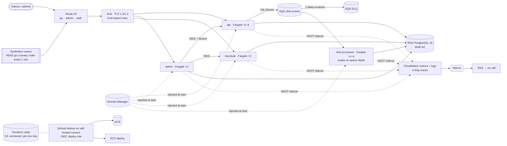

# Deployment and Operations

How the shortener runs on AWS: what gets deployed, where state lives, and how someone finds out that redirects are failing.

This page is the summary. The detail is in:
- the Terraform design (`docs/superpowers/specs/2026-10-02-terraform-aws-design.md`)
- its decision record (`docs/adr/0001-terraform-aws-plan-ready.md`)
- a full implementation plan (`docs/superpowers/plans/2026-10-02-terraform-aws.md`)

The plan is written but not applied: no AWS account was used.

## 1. How it gets deployed, and the moving pieces

**Platform-owned (assumed):**
- the VPC and subnets
- the ECS cluster
- the Route 53 hosted zone
- the Terraform state bucket
- the self-hosted CI runners

**Application-owned (Terraform, `terraform/`):**
- the ALB, ACM certificate and DNS records
- four Fargate services:
  - `api`: redirects and the REST API
  - `admin`: the HTMX UI
  - `keycloak`: OIDC
  - `click-processor`
- SQS and its DLQ, RDS, ECR, Secrets Manager entries, alarms and the CI deploy role

There are two environments, `staging` and `prod`. They use the same modules with different sizes.

**A deploy (pipeline, using the GitHub OIDC role; no long-lived AWS keys):**
1. Build the images, tag them with the git SHA, and push them to ECR. Tags are immutable.
2. Run the one-off `db-bootstrap` task: it idempotently creates the database roles and databases. Then run `migrate` (`alembic upgrade head`). Each must exit 0.
3. Roll each service onto a new task-definition revision. ECS starts the new tasks, waits for ALB health checks, then drains the old ones (100% minimum healthy). The deployment circuit breaker rolls back automatically if new tasks fail to become healthy.

Infrastructure changes go through `terraform plan` in review, then `apply` per environment, staging first.

## 2. Where the state lives, and what happens when compute is replaced

The compute is **stateless and disposable**: any task can be killed or replaced at any time. All state lives in managed services:

| State | Where | When tasks are replaced |
|---|---|---|
| Links, users' link ownership, block status | RDS `shortener` DB | Unaffected. Prod RDS is Multi-AZ with 7-day backups and point-in-time recovery; failover takes about 1–2 minutes. |
| Click stats (hourly rollups, referrers) | RDS `analytics` schema | Unaffected. Only the processor writes them, from SQS events. |
| Clicks not yet counted | SQS `click-events` (4-day retention) | Durable. If a processor dies mid-batch, it never deleted the messages, so they reappear after the 30 s visibility timeout and are counted at least once. Poison messages move to the DLQ after 5 attempts. |
| Clicks buffered inside an API task | Memory (up to 10,000) | On SIGTERM the API drains its buffer for up to 5 s. Anything left is **dropped and counted** (`shortener.click_events.dropped{reason}`). Clicks are best-effort by design; redirects never wait on them. |
| Admin sessions | RDS `admin.sessions` | Survive task replacement and scaling, so users stay signed in. That is why sessions aren't in memory or in a cookie. |
| Keycloak users, realms, sessions | RDS `keycloak` DB | Survive. Keycloak tasks cluster through the database. |
| Secrets | Secrets Manager | Injected when a task starts. Terraform generates them as write-only values, so they never appear in Terraform state. |
| Caches | Task memory | Lost and rebuilt: the processor's 60 s link lookup cache and the API's JWKS cache. The API doesn't cache links, so every redirect reads Postgres. |

**Deployment state:**
- **Terraform state** lives in the platform team's S3 bucket. Versioning gives rollback and recovery from bad writes. It's encrypted with SSE-KMS, public access is blocked, and the bucket policy limits access to the CI and deploy roles.
  - **One state file per environment and stack:** for example `shortener/prod/terraform.tfstate` and `shortener/staging/terraform.tfstate`. A change to staging can never lock or overwrite prod.
  - **Locking:** S3's native lock file (`use_lockfile = true`, Terraform ≥ 1.11). If the platform still uses DynamoDB lock tables, the backend sets `dynamodb_table` instead.
  - **Contents:** the state holds no secret values, but it does hold resource IDs and endpoints, so it's still treated as sensitive.
- **What's running** is recorded by ECR image tags (immutable, keyed by git SHA) and ECS task-definition revisions. Rolling back means pointing a service at the previous revision.

## 3. What we monitor, and how someone finds out that redirects are failing

Signals are layered from the outside in. Every alarm goes to one SNS topic, which the platform's on-call paging subscribes to.

| How you'd find out | Signal | Catches |
|---|---|---|
| **1. The canary pages** | A CloudWatch Synthetics canary sends `HEAD` to a dedicated short link (`https://go.<domain>/<canary code>`) every minute and expects `302`. Two failures in a row page. (HEAD doesn't count as a click, so the canary never pollutes stats.) | Everything a visitor would hit: DNS, the certificate, ALB rules, the api, the link lookup in Postgres. It's the only signal that sees DNS and TLS failures. |
| **2. Error-rate alarm** | ALB 5xx (from the targets **and** from the ALB itself) above 2% of requests for 5 min, when there are at least 50 requests. | App errors, database failures (redirects return 5xx), and no healthy targets (the ALB's own 502/503). |
| **3. Unhealthy targets** | Any target group with unhealthy hosts for 5 min. | Crash loops and failed health checks, before users notice. |
| **4. Click pipeline** | DLQ not empty; oldest click older than 5 min; processor running fewer than 1 task. | Stats falling behind. Redirects keep working: the click pipeline is decoupled. |
| **5. Database** | RDS CPU > 80% for 15 min; free storage < 2 GiB. | Capacity problems before they become outages. |

**Diagnosing.** The app's own metrics give the detail:
- `shortener.redirects{result}` (ok, not_found, blocked) and redirect latency
- clicks published and dropped
- processor lag

When something fails:
- **Traces:** every 5xx response and admin error page carries a `trace_id`. Paste it into X-Ray to see the request across admin → API → Postgres.
- **Logs:** every service writes JSON lines with that `trace_id` to CloudWatch Logs, so a Logs Insights query on it shows the matching log lines.

**Failure modes at a glance:**

| Failure | Redirects | Who notices first |
|---|---|---|
| RDS down or failing over | Fail (5xx) for the failover window | Canary, 5xx alarm |
| SQS unavailable | Keep working; clicks are dropped and counted | Dropped-clicks metric; backlog stays empty |
| Processor down | Keep working; stats lag | Processor-down and backlog alarms |
| DNS or certificate problem | Fail for everyone | Canary only |
| Bad deploy | Previous version keeps serving | Circuit breaker rolls back; unhealthy-targets alarm |

**Locally**, the same signals appear in Grafana (`make ui`): the Shortener Overview dashboard plus Tempo traces and Loki logs. They come from the same OpenTelemetry instrumentation that would feed CloudWatch and X-Ray on AWS.
