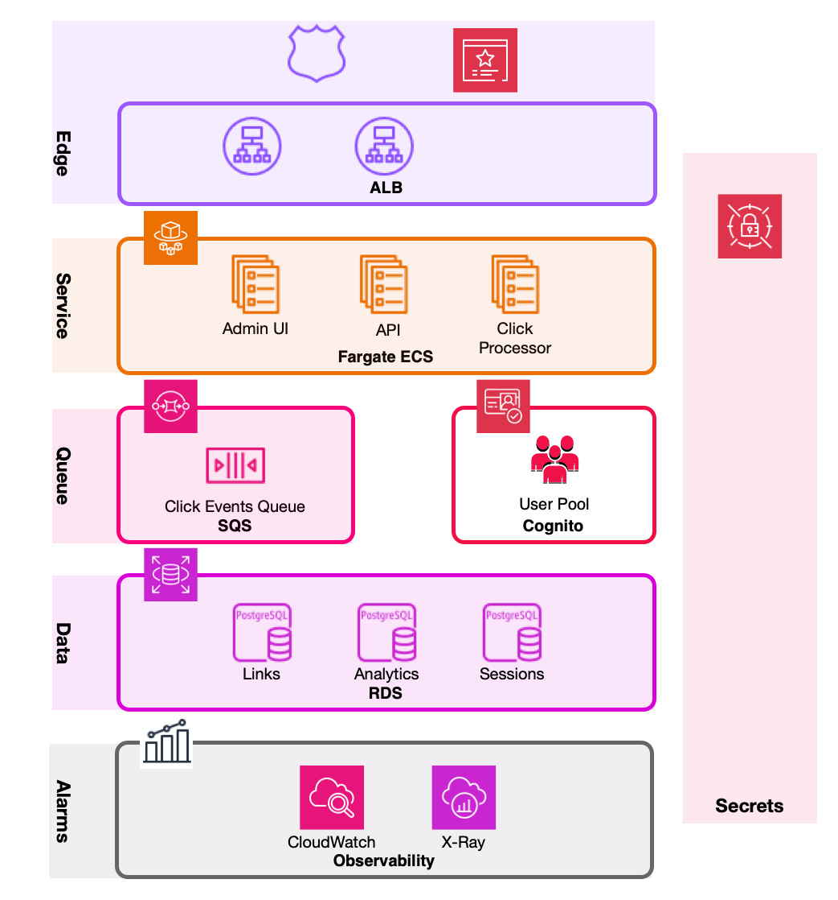

# Terraform for AWS

> [!NOTE]
> **Designed and planned, not built yet.** Nothing in this folder has been implemented, and it is
> never meant to be applied: my only AWS account runs services that are important to me, and
> deploying exercise infrastructure there would have put them at risk. This page shows what the
> folder will contain and links to the design. It is the README the plan creates, written early; the
> plan's last task expands it (diagram, platform inputs, deploy sequence, cost).

## Where the design lives

| Document | What it covers |
|---|---|
| [ADR 0001](../docs/adr/0001-terraform-aws-plan-ready.md) | One-page summary: status and the decisions (T1–T10) |
| [ADR 0002](../docs/adr/0002-cognito-production-idp.md) | Cognito as the production identity provider; Keycloak on Fargate is first-pass only |
| [Terraform design spec](../docs/superpowers/specs/2026-10-02-terraform-aws-design.md) | Layout, platform inputs, edge, data and secrets, services, observability, verification |
| [Implementation plan](../docs/superpowers/plans/2026-10-02-terraform-aws.md) | 12 test-first tasks, one module at a time |
| [Handoff](../docs/superpowers/plans/2026-10-02-terraform-aws-HANDOFF.md) | Where to resume |
| [Operations](../docs/operations.md) | The AWS deployment diagram, where state lives, monitoring and alerting |

## Planned layout



Each row is a module below: `edge`, `service`, `queue`, `data`, `alarms`, with `secrets` alongside.
Cognito is the production identity provider ([ADR 0002](../docs/adr/0002-cognito-production-idp.md)); this
first pass runs Keycloak on Fargate instead, to keep it small. Shield/WAF is drawn as a possible
addition: the plan puts no WAF in front of the ALB. Observability is CloudWatch and X-Ray.

```
terraform/
  modules/
    queue/            SQS click-events queue + dead-letter queue, redrive policy
    secrets/          Secrets Manager secrets with write-only values (never in state)
    data/             RDS PostgreSQL 16, subnet and parameter groups, security group
    ecr/              one repository per image, scan on push, lifecycle policy
    edge/             ACM certificate, ALB, listeners, host rules, Route 53 records
    service/          generic Fargate service (app + ADOT sidecar), IAM, logs, autoscaling
    task/             one-off task definitions (db-bootstrap, migrate)
    alarms/           SNS topic, CloudWatch alarms, redirect canary
    ci-deploy-role/   GitHub OIDC deploy role, least privilege
    stack/            composes the modules above into the whole application
  envs/
    staging/          thin root: calls stack with staging sizes, S3 backend
    prod/             same shape, prod sizes and protection settings
  testing/            shared mock-provider fixtures for terraform test
  scripts/
    db-bootstrap.sh   idempotent database roles and databases (run as a one-off ECS task)
```

## Key decisions

From the [ADR](../docs/adr/0001-terraform-aws-plan-ready.md), where each has its reasoning:

- **Never applied, tested offline.** `fmt`, `validate`, `tflint`, `trivy` and `terraform test`
  with a mocked AWS provider, locally and in CI. No credentials needed.
- **Plugs into a platform.** The VPC, subnets, ECS cluster and Route 53 zone already exist and are
  passed in as IDs. This stack owns its own ALB, certificate and DNS records.
- **Secrets never reach state.** Generated passwords are ephemeral and written with write-only
  arguments; RDS manages its own master password.
- **Database setup is a one-off ECS task** running an idempotent `psql` script, not the PostgreSQL
  provider (RDS is private, so that provider would break offline planning).
- **Keycloak on Fargate is a stand-in.** It keeps the first pass to one identity provider; production
  moves to Cognito ([ADR 0002](../docs/adr/0002-cognito-production-idp.md)).
- **Deploys use GitHub OIDC**, with a role pinned to the repository and environment. No long-lived
  keys.
- **Observability is CloudWatch-only**: an ADOT sidecar sends metrics to CloudWatch and traces to
  X-Ray, from the same OpenTelemetry instrumentation that feeds Grafana locally.
- **State lives in a platform-owned S3 bucket**, one key per environment, with native S3 locking.

## Checks (once built)

```bash
make tf-check   # fmt, then init -backend=false + validate + test per root, tflint, trivy
```

Pinned tools: Terraform 1.16.5 (via tfenv), tflint 0.64.0, trivy 0.75.0.
